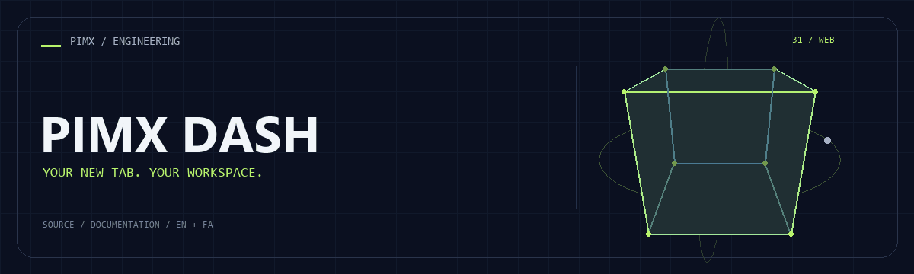
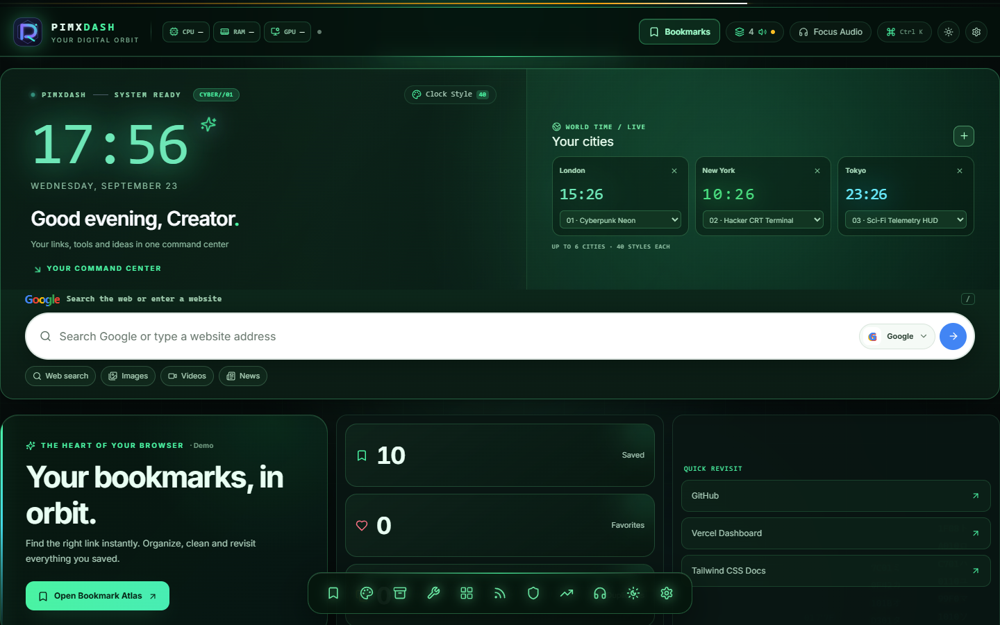

<div align="center">



**[English](README.md) · [فارسی](README.fa.md)**

</div>

<div dir="rtl">

# 🧩 PIMX DASH

افزونه صفحه تب جدید Chrome و Chromium با Manifest V3، متمرکز بر نشانک، جست‌وجوی سریع، ابزار تمرکز و ویجت بهره‌وری.

[GitHub](https://github.com/MOHAMMADREZAABEDINPOOR/PIMXDASH) · [PIMX / Profile](https://github.com/MOHAMMADREZAABEDINPOOR) · [بنر ثابت](assets/readme/hero.png)

| نمای کلی | جزئیات |
|:---|:---|
| 🧩 تجربه | افزونه تب جدید Chrome / Chromium |
| 🧰 فناوری | `React` · `Vite` · `TypeScript` · `Tailwind CSS` |
| 🌐 زبان راهنما | [English](README.md) · [فارسی](README.fa.md) |

[✨ امکانات](#امکانات) · [🚀 شروع کار](#شروع-کار) · [⚙️ تنظیمات](#تنظیمات) · [🌍 استقرار](#استقرار)

---

<a id="امکانات"></a>

## ✨ امکانات

| بخش | قابلیت موجود |
|:---|:---|
| ⭐ مجموعه | مرکز نشانک، جست‌وجو و دسته‌بندی |
| 🗓️ برنامه‌ریزی | کارها، یادداشت، عادت، پومودورو و ساعت جهان |
| ⚡ روند کار | هوا، RSS و خبر و صداهای محیطی |
| 🌐 تجربه کاربری | استودیوی پوسته، میانبر و رابط فارسی و انگلیسی |

## نمای برنامه



<a id="پشته-فنی"></a>

## 🧰 پشته فنی

| ابزار | نسخه یا منبع |
|---|---|
| React | `^18.3.1` |
| Vite | `^6.1.0` |
| TypeScript | `^5.7.3` |
| Tailwind CSS | `^3.4.17` |

<a id="شروع-کار"></a>

## 🚀 شروع کار

Node.js 22.12 یا بالاتر و مدیر پکیج مشخص‌شده در package.json. نسخه وابستگی‌ها را مطابق فایل قفل نصب کنید.

<div dir="ltr">

```bash
git clone https://github.com/MOHAMMADREZAABEDINPOOR/PIMXDASH.git
cd PIMXDASH

npm ci
npm run build
```

</div>

<a id="تنظیمات"></a>

## ⚙️ تنظیمات

فایل محیط استاندارد تعریف نشده است. برای تمرین‌های مستقل تنظیم خارجی لازم نیست؛ اگر در کد ثابت‌های سرویس یا مسیر وجود دارد، آن‌ها را پیش از اجرا بررسی کنید.

<a id="استفاده"></a>

## 🎯 استفاده

npm run build را اجرا، chrome://extensions را باز و Developer mode را فعال کنید؛ سپس Load unpacked و پوشه dist را انتخاب کنید. تب جدید باز و راه‌اندازی اولیه را تکمیل کنید. پیش‌نمایش Vite جای API افزونه را نمی‌گیرد.

<a id="ساختار-پروژه"></a>

## 🗂️ ساختار پروژه

| مسیر | نقش |
|---|---|
| [`assets/`](assets/) | فایل برند، رسانه و README |
| [`public/`](public/) | فایل عمومی وب |
| [`scripts/`](scripts/) | ابزار توسعه و نگهداری |
| [`src/`](src/) | کد برنامه |
| [`index.html`](index.html) | فایل ورودی یا تنظیم پروژه |
| [`newtab.html`](newtab.html) | فایل ورودی یا تنظیم پروژه |
| [`package.json`](package.json) | فایل ورودی یا تنظیم پروژه |
| [`tsconfig.json`](tsconfig.json) | فایل ورودی یا تنظیم پروژه |

<a id="فرمان‌ها-و-بررسی"></a>

## 🧪 فرمان‌ها و بررسی

| فرمان | کاربرد |
|:---|:---|
| `npm run dev` | 🧑‍💻 سرور توسعه |
| `npm run build` | 📦 ساخت نسخه انتشار |
| `npm run preview` | 👀 پیش‌نمایش خروجی |
| `npm run type-check` | 🔧 type-check |
| `npm run check:bookmarks` | 🔧 check:bookmarks |

<div dir="ltr">

```bash
npm run dev
npm run build
npm run preview
npm run type-check
npm run check:bookmarks
npm run check:background
npm run check:weather
npm run check:quotes
```

</div>

این‌ها فرمان‌های موجود در package.json هستند؛ فهرست بالا گزارش اجرای آزمون نیست. فرمان تست ممکن است مرورگر، سرویس یا دیتابیس آماده بخواهد.

<a id="استقرار"></a>

## 🌍 استقرار

خروجی npm run build همان پوشه dist قابل بارگذاری در Chrome است. برای فروشگاه افزونه، Manifest و سیاست حریم خصوصی باید با مجوزهای واقعی تطبیق داده شوند.

<a id="محدودیت‌ها"></a>

## 📌 محدودیت‌ها

Manifest مجوز نشانک، تاریخچه، تب، مکان، سیستم و اعلان و دسترسی اسکریپت به صفحات HTTP/HTTPS می‌خواهد. خبرهای بیرونی به سرویس وابسته هستند؛ مجوزها را پیش از نصب بررسی کنید.

<a id="رفع-مشکل"></a>

## 🛠️ رفع مشکل

- پکیج غایب: وابستگی را با مدیر پکیج پروژه نصب کنید.
- خطای API یا شبکه: آدرس، سرویس و اتصال میزبانی را بررسی کنید.
- فایل قدیمی: در صورت وجود اسکریپت ساخت، build و کش مرورگر را تازه کنید.

<a id="مشارکت"></a>

## 🤝 مشارکت

برای تغییر، شاخه مستقل بسازید، رفتار فعلی را بررسی کنید و توضیح روشن همراه تغییر بفرستید. اطلاعات خصوصی، خروجی build و دیتابیس محلی را commit نکنید.

<a id="مجوز"></a>

## 📄 مجوز

فایل مجوز در این نسخه موجود نیست. نمایش عمومی کد به‌تنهایی مجوز استفاده مجدد نیست؛ برای شرایط استفاده با مالک مخزن هماهنگ کنید.

---

ساخته‌شده در مجموعه **PIMX** · مستندات فارسی و انگلیسی.

---

<div align="center">

🧩 **PIMX DASH** · [English](README.md) · [فارسی](README.fa.md)

</div>

</div>
